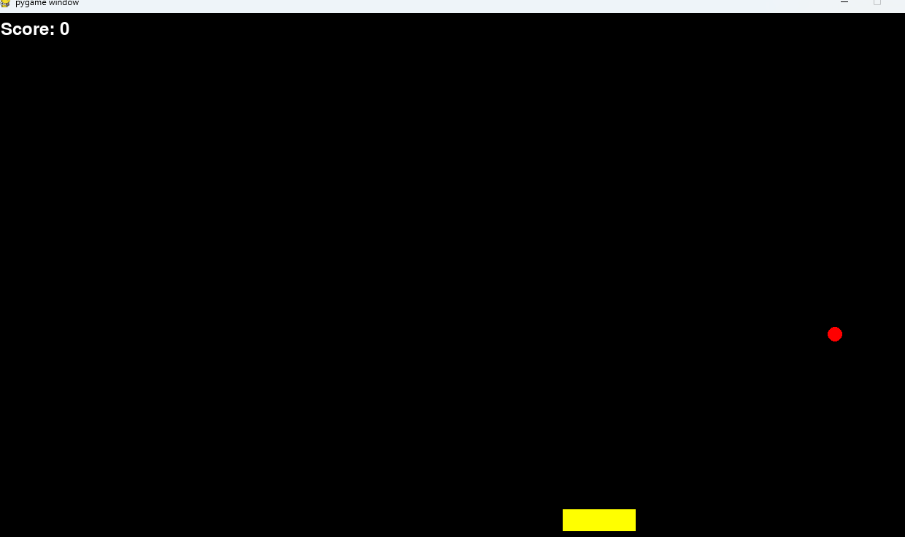

# Reinforcement Learning in PyGame: Catching Balls with AI

## Inspiration

This project draws inspiration from a YouTube video ([https://www.youtube.com/watch?v=ejtJHnzJyGw&t=1s](https://www.youtube.com/watch?v=ejtJHnzJyGw&t=1s)) showcasing an AI model trained through Reinforcement Learning. Inspired by this demonstration, we aim to train an AI model to excel at a custom PyGame game.

## The Game: A Retro Catching Challenge

Our game is a retro-style ball catching challenge implemented in PyGame.

### Gameplay

* **Player:** Represented by a paddle at the bottom of the screen, the player can move left and right.
* **Balls:** Descending from the top at varying intervals and positions, the balls move at a constant speed downwards.
* **Objective:** Catch as many balls as possible by colliding with them.
* **Scoring:**
  * Catching a ball: +1 point
  * Missing a ball: -1 point

### AI Training

We will utilize Reinforcement Learning to train an initially unskilled AI model to play the game effectively. To achieve this, the model must consider several factors:

1. **Player Position:** The model needs to track the paddle's location on the screen.
2. **Ball Positions:** The model must identify the location and movement of each ball.
3. **Score:** The model should strive to maximize the score by catching balls and avoiding misses.
